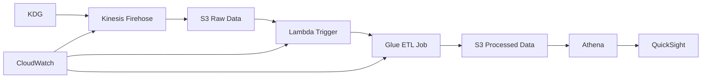

# 🏗️ AWS Data Lake Demo - Terraform Infrastructure

[](https://terraform.io)
[](https://aws.amazon.com)
[](LICENSE)

> **Infraestrutura completa de Data Lake na AWS usando Terraform, com pipeline de ingestão em tempo real, processamento ETL e visualização de dados.**

## 🌍 Languages / Idiomas

- 🇺🇸 **English**: You're reading it!
- 🇧🇷 **Português**: [Guia completo de implantação](GUIA_IMPLANTACAO.md)

## 📋 Overview

This project demonstrates a complete AWS Data Lake implementation, including:

- **Real-time ingestion** via Kinesis Data Firehose
- **Automated ETL processing** with AWS Glue
- **Optimized storage** in S3 (raw + processed)
- **SQL queries** with Amazon Athena
- **Integrated monitoring** with CloudWatch
- **Data visualization** with Amazon QuickSight

## 🏗️ Arquitetura



### Componentes

| Service | Function | Configuration |
|---------|----------|---------------|
| **Kinesis Firehose** | Ingestão de dados | Buffer: 1MB/1min |
| **S3** | Data Lake Storage | Raw + Processed |
| **Lambda** | Transformação + Trigger | Python 3.9 |
| **Glue** | ETL Processing | Spark, Parquet |
| **Athena** | SQL Queries | Workgroup dedicado |
| **CloudWatch** | Monitoring | 7 dias retenção |

## 🚀 Quick Start

### Prerequisites

```bash
# Install dependencies
terraform --version  # >= 1.0
aws --version        # >= 2.0
```

### Deployment

```bash
# 1. Clone repository
git clone https://github.com/your-username/aws-data-lake-demo.git
cd aws-data-lake-demo

# 2. Configure AWS
aws configure

# 3. Deploy infrastructure
terraform init
terraform plan
terraform apply
```

### KDG Setup

1. **CloudFormation**: [Create Cognito User](https://awslabs.github.io/amazon-kinesis-data-generator/web/help.html)
2. **Template KDG**:
```json
{
  "year": "{{random.number({\"min\":1850,\"max\":1900})}}",
  "firstname": "{{name.firstName}}",
  "lastname": "{{name.lastName}}",
  "city": "{{address.city}}",
  "state": "{{address.state}}",
  "transactionamount": {{random.number({"min":10,"max":150})}}
}
```

## 📊 Resources Created

### Core Infrastructure
- ✅ S3 Bucket (versionado)
- ✅ Kinesis Firehose Delivery Stream
- ✅ Lambda Functions (2x)
- ✅ Glue Database + Job + Table
- ✅ Athena Workgroup
- ✅ IAM Roles + Policies

### Monitoramento
- ✅ CloudWatch Log Groups
- ✅ Firehose Logging
- ✅ Lambda Error Tracking
- ✅ Glue Job Monitoring

## 🧪 Testing

### Send Data
```bash
# Via KDG (interface web)
# Ou via AWS CLI
aws firehose put-record \
  --delivery-stream-name data-lake-demo-firehose \
  --record Data='{"name":"test","value":123}'
```

### Query Data
```sql
-- Athena Console
SELECT COUNT(*) FROM processed_data;

SELECT city, COUNT(*) as total 
FROM processed_data 
GROUP BY city 
ORDER BY total DESC 
LIMIT 10;
```

## 📁 Project Structure

```
├── main.tf                 # Main resources
├── iam.tf                  # Roles and policies
├── glue_catalog.tf         # Tables and schema
├── cloudwatch.tf           # Logs and monitoring
├── outputs.tf              # Terraform outputs
├── kdg_template.json       # KDG template
├── GUIA_IMPLANTACAO.md     # Complete guide (PT-BR)
└── README.md               # This file
```

## 🔧 Advanced Configuration

### Terraform Variables

```hcl
variable "aws_region" {
  description = "AWS region"
  default     = "us-east-1"
}

variable "project_name" {
  description = "Project name prefix"
  default     = "data-lake-demo"
}
```

### Customization

- **Firehose Buffer**: Adjust `buffering_size` and `buffering_interval`
- **Glue Workers**: Modify `number_of_workers` based on volume
- **Log Retention**: Change `retention_in_days` in CloudWatch

## 📊 Monitoramento

### CloudWatch Dashboards

Acesse os logs em:
- `/aws/kinesisfirehose/data-lake-demo-firehose`
- `/aws/lambda/data-lake-demo-transformer`
- `/aws/lambda/data-lake-demo-glue-trigger`
- `/aws-glue/jobs/logs-v2`

### Important Metrics

- **Firehose**: DeliveryToS3.Records
- **Lambda**: Duration, Errors
- **Glue**: Job Success Rate
- **S3**: Object Count, Storage

## 🔒 Security

### IAM Policies
- **Least privilege principle**
- **Service-specific roles**
- **No hardcoded credentials**

### Data
- **Encryption at rest** (S3)
- **Encryption in transit** (HTTPS)
- **VPC endpoints** (optional)

## 💰 Estimated Costs

| Service | Monthly Cost (estimated) |
|---------|-------------------------|
| S3 | $5-20 |
| Firehose | $10-30 |
| Lambda | $1-5 |
| Glue | $10-50 |
| Athena | $5-15 |
| **Total** | **$31-120** |

> *Costs vary based on data volume and region*

## 🧹 Cleanup

```bash
# Empty S3 bucket (AWS console)
# Then run:
terraform destroy
```

## 🤝 Contributing

1. Fork the project
2. Create a feature branch (`git checkout -b feature/new-feature`)
3. Commit your changes (`git commit -am 'Add new feature'`)
4. Push to the branch (`git push origin feature/new-feature`)
5. Open a Pull Request

## 📝 Roadmap

- [ ] Integração com AWS Step Functions
- [ ] Suporte a múltiplas regiões
- [ ] Terraform modules
- [ ] CI/CD pipeline
- [ ] Testes automatizados

## 📄 Licença

Este projeto está licenciado sob a Licença MIT - veja o arquivo [LICENSE](LICENSE) para detalhes.

## 🙋‍♂️ Support

- **Issues**: [GitHub Issues](https://github.com/your-username/aws-data-lake-demo/issues)
- **Documentation**: [Complete Guide (PT-BR)](GUIA_IMPLANTACAO.md)
- **AWS Docs**: [Data Lake Guide](https://docs.aws.amazon.com/whitepapers/latest/building-data-lakes/welcome.html)

---

**⭐ If this project was helpful, please give it a star!**

**Built with ❤️ for the AWS community**